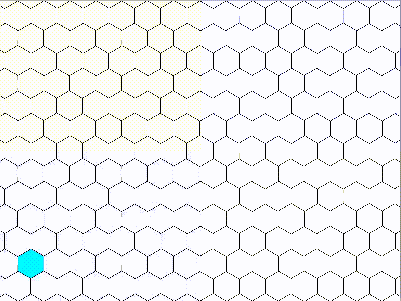

# tess



`tess` is a library for tessalating hexagons into grids. It provides basic
functionality such as converting hex coordinates to pixel coordinates and vice
versa, or calculating a set of hex cooridinates within a radius from a certain
point. The library is largely inspired by Amit Patel's
[blog post](https://www.redblobgames.com/grids/hexagons/) on the matter.

## Installation

`tess` is a template library, so it may be that the easiest way to install it is
just to copy the header files into your project's include directory. You can
also install it via cmake:

```shell
$ git clone https://github.com/josiest/tess.git && cd tess
$ mkdir build && cd build
$ cmake ..
$ sudo cmake --install .
```

## Documentation

Under construction ...
