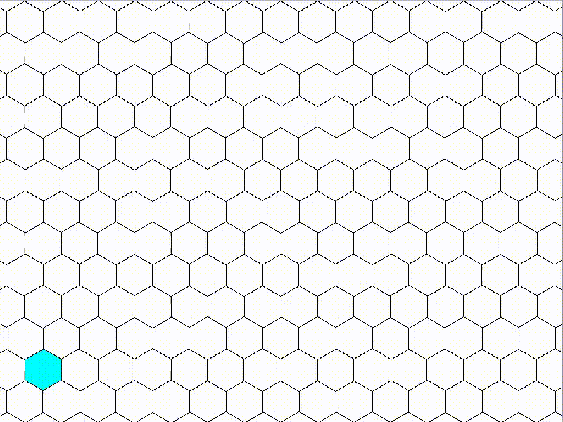

# hax

`hax` is a library for working with hexagon grids. It provides basic
functionality such as converting hex coordinates to pixel coordinates and vice
versa, or calculating a set of hex cooridinates within a radius from a certain
point. The library is largely inspired by Amit Patel's
[blog post](https://www.redblobgames.com/grids/hexagons/) on the matter.

## Installation

`hax` is a template library, so just copy the header files into your project's
include directory.

## Documentation

Can be found [here]().
