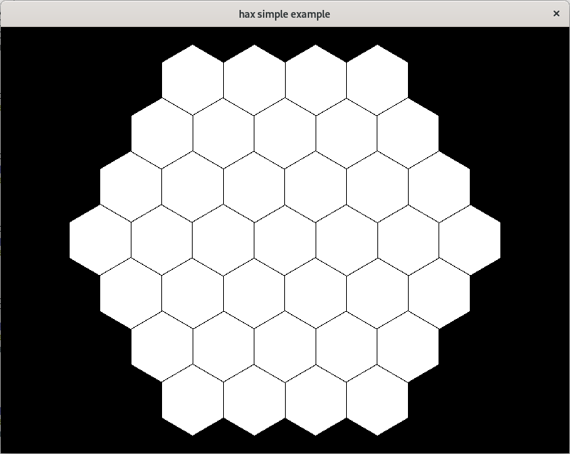

.. tess documentation master file, created by
   sphinx-quickstart on Wed Jun 10 16:20:50 2020.

tess
====

tess is a library for working with hexagonally tiled maps. It provides functions
for working with hexagonal norms as well as converting between hex coordinates
and pixel coordinates, and many other utilities. The library is largely
inspired by Amit Patel's
`blog post <https://www.redblobgames.com/grids/hexagons/>`_ on the matter.

.. image:: ../examples/resources/tess.gif

installation
------------

tess is a template library, so all that really needs to be done is to copy the
header files into a directory where your project can see them. This may mean
copying the files directly into your project's include directory, or copying
them to a global directory that your project knows to look in when compiling.
The source can be found on `github <https://github.com/josiest/tess>`_. 

basic usage
-----------

This simple example will cover basic usage of the library by using a set of tiles
to draw a grid. The example uses the `SFML library <https://www.sfml-dev.org/>`_
and its source can be found :download:`here <../examples/src/simple.cpp>`.

We'll start out by declaring some basic settings, then initializing some utilities
we'll need to use. We'll use `Basis` to convert pixel coordinates in screen space
into hex coordinates in local space and vice versa.

.. literalinclude:: ../examples/src/simple.cpp
   :lines: 22-32
   :dedent: 4
   :language: cpp

Next, we'll need to calculate the vertices of a hex in screen space in order to
draw it to the screen. Thankfully, tess has a function just for that, but we still
need to translate it into `SFML`'s interface. So here's a here's a helper function
to do that.

.. literalinclude:: ../examples/src/simple.cpp
   :lines: 6-18
   :language: cpp

Now we can use `hex_range` to create a set of hex coordinates within a given radius
of a center point. We'll use this with our helper function to draw a hexagonal grid.

.. literalinclude:: ../examples/src/simple.cpp
   :lines: 34-42
   :dedent: 4
   :language: cpp

From here we can just use a trivial SFML event loop to get a working program. After
polling the events, we can draw the hexes.

.. literalinclude:: ../examples/src/simple.cpp
   :lines: 54-59
   :dedent: 8
   :language: cpp

The full source code for this example can once again be found
:download:`here <../examples/src/simple.cpp>`, and a more complex example can be found
:download:`here <../examples/src/highlight.cpp>`. There is also a
:download:`CMake file <../examples/CMakeLists.txt>` to compile these examples.

documentation
=============

math functions
--------------
.. doxygenfunction:: tess::norm(const Point<T> &p) noexcept

|

.. doxygenfunction:: tess::normf(const Point<T> &p) noexcept

|

.. doxygenfunction:: tess::sqnorm(const Point<T> &p) noexcept

|

.. doxygenfunction:: tess::hex_norm(const Hex<T> &h) noexcept

|

.. doxygenfunction:: tess::hex_round(const tess::Hex<R> &h)

|

.. doxygenfunction:: tess::line

|

.. doxygenfunction:: tess::hex_range

point
-----
.. doxygenclass:: tess::Point
   :members:

hex
---
.. doxygenclass:: tess::Hex
   :members:

basis
-----
.. doxygenclass:: tess::Basis
   :members:
